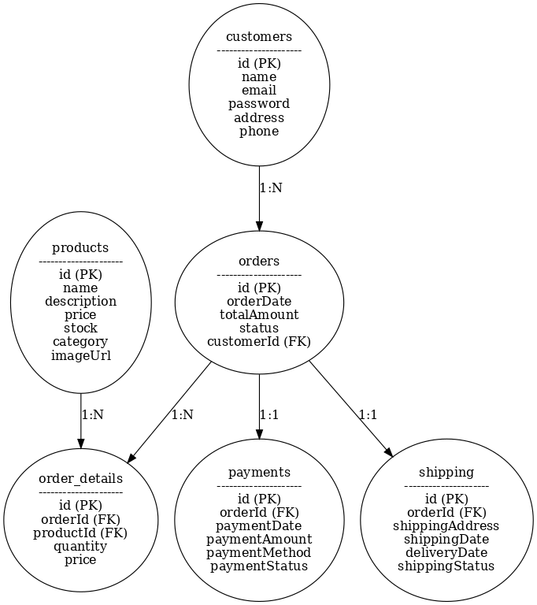
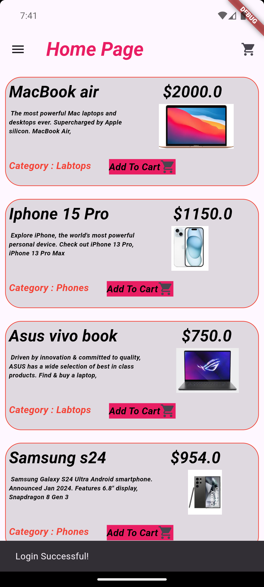
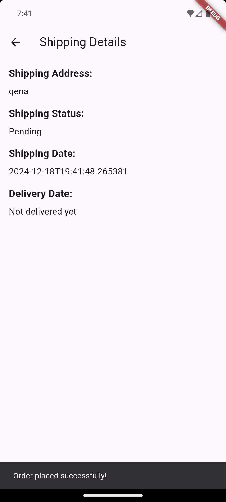

# E-Commerce app

# E-commerce Application - Database and Class Design

## Classes Overview

### 1. **Products**

| Attribute     | Type    | Description                        |
| ------------- | ------- | ---------------------------------- |
| `id`          | Integer | Unique identifier for the product. |
| `name`        | String  | Name of the product.               |
| `description` | String  | Description of the product.        |
| `price`       | Decimal | Price of the product.              |
| `stock`       | Integer | Quantity in stock.                 |
| `category`    | String  | Category of the product.           |
| `imageUrl`    | String  | URL to the product image.          |

---

### 2. **Customers**

| Attribute  | Type    | Description                         |
| ---------- | ------- | ----------------------------------- |
| `id`       | Integer | Unique identifier for the customer. |
| `name`     | String  | Customer's full name.               |
| `email`    | String  | Customer's email address (unique).  |
| `password` | String  | Encrypted password.                 |
| `address`  | String  | Customer's shipping address.        |
| `phone`    | String  | Contact phone number.               |

---

### 3. **Orders**

| Attribute     | Type     | Description                                          |
| ------------- | -------- | ---------------------------------------------------- |
| `id`          | Integer  | Unique identifier for the order.                     |
| `orderDate`   | DateTime | Date the order was placed.                           |
| `totalAmount` | Decimal  | Total amount for the order.                          |
| `status`      | String   | Status of the order (e.g., 'Processing', 'Shipped'). |
| `customerId`  | Integer  | Foreign key referencing `customers.id`.              |

---

### 4. **OrderDetails**

| Attribute   | Type    | Description                             |
| ----------- | ------- | --------------------------------------- |
| `id`        | Integer | Unique identifier for the order detail. |
| `orderId`   | Integer | Foreign key referencing `orders.id`.    |
| `productId` | Integer | Foreign key referencing `products.id`.  |
| `quantity`  | Integer | Quantity of the product ordered.        |
| `price`     | Decimal | Price per unit of the product.          |

---

### 5. **Payments**

| Attribute       | Type     | Description                                        |
| --------------- | -------- | -------------------------------------------------- |
| `id`            | Integer  | Unique identifier for the payment.                 |
| `orderId`       | Integer  | Foreign key referencing `orders.id`.               |
| `paymentDate`   | DateTime | Date the payment was made.                         |
| `paymentAmount` | Decimal  | Amount paid.                                       |
| `paymentMethod` | String   | Method of payment (e.g., 'Credit Card', 'PayPal'). |
| `paymentStatus` | String   | Status of the payment (e.g., 'Paid').              |

---

### 6. **Shipping**

| Attribute         | Type     | Description                                  |
| ----------------- | -------- | -------------------------------------------- |
| `id`              | Integer  | Unique identifier for the shipping entry.    |
| `orderId`         | Integer  | Foreign key referencing `orders.id`.         |
| `shippingAddress` | String   | Address where the order is shipped.          |
| `shippingDate`    | DateTime | Date the order was shipped.                  |
| `deliveryDate`    | DateTime | Expected or actual delivery date.            |
| `shippingStatus`  | String   | Status of the shipment (e.g., 'In Transit'). |

---

# ER Database Diagram

# Preview of E-Commerce

  
  
  
  
  
  

